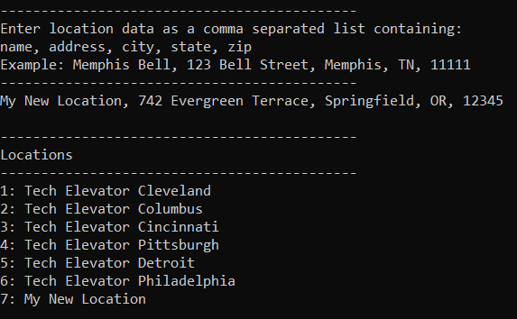
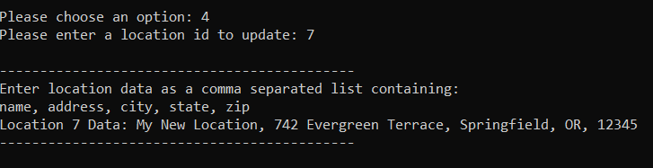
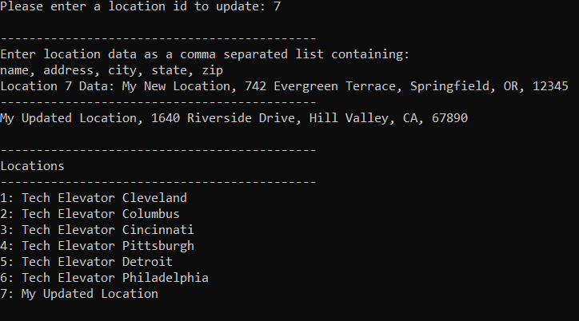

# Web Services POST, PUT, DELETE Tutorial (C#)

In this tutorial, you'll extend the Tech Elevator Locations example from the first day by adding functionality to:

* Add a new Location (`POST`)
* Modify an existing Location (`PUT`)
* Remove a Location (`DELETE`)
* Capture and handle HTTP exceptions

When complete, this produces a full **C**reate **R**ead **U**pdate **D**elete (CRUD) console Web client application.

## Step One: Start the server

Before you start, make sure that the web API is up and running. First, change directories into the `./server/` folder.

Next, run the command `npm install` to install any dependencies. You won't need to do this on any subsequent run.

To start the server, run the command `npm start`. If there aren't any errors, you'll see the following, which means that you've successfully set up your web API:

```
 \{^_^}/ hi!

  Loading ./locations.json
  Done

  Resources
  http://localhost:3000/locations

  Home
  http://localhost:3000

  Type s + enter at any time to create a snapshot of the database
  Watching...
```

## Step Two: Review the starting code

This tutorial code is similar to the tutorial code you worked on from the previous day.

The API code has been moved to the `APIService.cs` class. You'll add code to complete the `AddLocation()`, `UpdateLocation()`, and `DeleteLocation()` methods. If you review the `GetAllLocations()` and `GetDetailsForLocation()` methods, you'll see that they're similar to the `GET` code you wrote the previous day. The API URL and a RestSharp client have been defined as variables at the top of the class file.

The `Program.cs` class contains the `Main` method, as well as the code to provide the menu, read input, and print the locations to the console.

The `Data\Location.cs` class still contains the properties such as `Id` and `Address`, but a constructor has been added that accepts a CSV (comma separated values) string to deserialize it into a `Location` object.

Another property, `IsValid`, has been added, too. `IsValid` denotes the object as valid if the `Name`, `Address`, `City`, `State`, and `Zip` properties are all not null. The `Id` can be null for the purpose of creating a new location as the ID is assigned by the server.

## Step Three: Add a location with POST

Open the `APIService.cs` file and find the `AddLocation()` method:

```csharp
public Location AddLocation(Location newLocation)
{
    //api code here
    return null;
}
```

The code to make a `POST` request with RestSharp is similar to the code you write to make `GET` requests. First, define a new `RestRequest` object, passing it the `API_URL` variable:

```csharp
RestRequest request = new RestRequest(API_URL);
```

Then, you need to attach the data that you want to send with the `POST` request. You can accomplish this by passing the `newLocation` object to the `.AddJsonBody()` method of the request you defined:

```csharp
request.AddJsonBody(newLocation);
```

Now you're ready to make the `POST` request. As with `GET` requests, you use a type parameter to let RestSharp automatically serialize the request data, and deserialize the response data. Instead of using `.Get()`, you use the `.Post()` method of the RestClient:

```csharp
IRestResponse<Location> response = client.Post<Location>(request);
```

Finally, return the deserialized response data, and remove the original `return null` if you haven't already:

```csharp
return response.Data;
```

The calling code in `Program.cs` checks that the return value isn't null as a sign of success.

The `AddLocation()` method looks like this when you're done:

```csharp
public Location AddLocation(Location newLocation)
{
    RestRequest request = new RestRequest(API_URL);
    request.AddJsonBody(newLocation);
    IRestResponse<Location> response = client.Post<Location>(request);
    return response.Data;
}
```

Run the application now and select option 3: Add a Tech Elevator Location. Follow the on-screen instructions for entering the location data and press Enter when done:


When you submit the data, the program re-retrieves the list of all locations and displays them. You'll see the location you added at the bottom of the list:



## Step Four: Modify a location with PUT

Next, you'll modify the `UpdateLocation()` method. This method is like the `AddLocation()` method, but it's passed an existing location—`locationToUpdate`—rather than a brand new location.

Start again by creating a `RestRequest` object. This time, you'll pass it the `API_URL` variable with a `/` and the location ID appended to it:

```csharp
RestRequest request = new RestRequest(API_URL + "/" + locationToUpdate.Id);
```

The URL is different because you're using the HTTP `PUT` method to update an existing record, and the ID of the record you want to update is given in the URL. Since you have a `Location` object, you'll use the `Id` property of it to append to the URL.

As with `POST` requests, you attach the data you want to send with `.AddJsonBody()`:

```csharp
request.AddJsonBody(locationToUpdate);
```

Next, send the request using the `.Put()` method of the RestSharp client. Be sure to use the type parameter so RestSharp can serialize the request data and deserialize the response data for you:

```csharp
IRestResponse<Location> response = client.Put<Location>(request);
```

Finally, return the deserialized response data, and remove the original `return null` if you haven't already:

```csharp
return response.Data;
```

As with `AddLocation()`, the calling code in `Program.cs` checks that the return value isn't null as a sign of success.

The `UpdateLocation()` method looks like this when you're done:

```csharp
public Location AddLocation(Location newLocation)
{
    RestRequest request = new RestRequest(API_URL + "/" + locationToUpdate.Id);
    request.AddJsonBody(locationToUpdate);
    IRestResponse<Location> response = client.Put<Location>(request);
    return response.Data;
}
```

Run the application now. Select option 4: Update a Tech Elevator Location, and enter the id of the location you want to update. Similar to the steps for adding a location, follow the on-screen instructions for entering the location data and press Enter when done:



When you submit the data, the program re-retrieves the list of all locations and displays them. If you entered a new name for the location you updated, you'll see the new name in the list:



You can also use menu option 2 to view the details of your updated location:


## Step Five: Delete a location with DELETE

Next, you'll modify the `DeleteLocation()` method. Notice that the parameter for the method is an `int` and not a `Location` object. Similar to updating a location, you'll supply the `id` of the location in the URL; however, you don't need to send any other data.

Like the other methods, start off with a `RestRequest` object, appending a `/` and `locationId` to the URL:

```csharp
RestRequest request = new RestRequest(API_URL + "/" + locationId);
```

Since `DELETE` methods don't receive or send data, there's nothing to attach and a type parameter isn't required. Create the response:

```csharp
IRestResponse response = client.Delete(request);
```

Since there's no data to receive and nothing to `return` to the calling code, the method is `void`.

The completed `DeleteLocation()` method looks like this when you're done:

```csharp
public void DeleteLocation(int locationId)
{
    RestRequest request = new RestRequest(API_URL + "/" + locationId);
    IRestResponse response = client.Delete(request);
}
```

Run the application now. Select option 5: Delete a Tech Elevator Location, and enter the id of the location you want to delete. When you press Enter, the program re-retrieves the list of all locations. You shouldn't see the location you deleted:


## Step Six: Test your application

Run the application and execute each menu item. If you followed the instructions, the application works as expected. If you encounter any issues, go back and review the previous steps.

From the main menu, select option 4. When prompted for a location id, enter `999` and observe the result:


Your application shouldn't assume that the request was successful and that data is available. This is true of all code you write, not just this tutorial. The next step shows you how to add error handling to the API requests.

## Step Seven: Add exception handling for HTTP errors

The particular method that's causing the issue above is `GetDetailsForLocation()`. Take a look at the method in the `APIService.cs` file:

```csharp
public Location GetDetailsForLocation(int locationId)
{
    RestRequest requestOne = new RestRequest(API_URL + "/" + locationId);
    IRestResponse<Location> response = client.Get<Location>(requestOne);
    return response.Data;
}
```

The code appends the location ID to the URL, resulting in `/locations/999`.

Take a look at the output from the console window where you're running the json-server. You can see each request that's made along with the response code:


The server returns a `404` because there's no location with that ID and no data to return. RestSharp still tries to deserialize the response into the type you specify, so it returns an empty object which the application still tries to use, resulting in the output you saw in step six.

In the `GetDetailsForLocation()` method, remove the `return` statement, and add this `if` block:

```csharp
if (response.ResponseStatus != ResponseStatus.Completed)
{
    Console.WriteLine("An error occurred communicating with the server.");
    return null;
}
```

This code first checks that a response wasn't received by checking for `ResponseStatus` not being equal to `Completed`. RestSharp only sets the `ResponseStatus` to `Completed` if a response was received. If a response isn't received, it outputs an error message and returns `null`.

But that's not enough—you did receive a response, but it was a `404`. Add this `else if` block after the previous `if`:

```csharp
else if (!response.IsSuccessful)
{
    Console.WriteLine("An error response was received from the server. The status code is " + (int)response.StatusCode);
    return null;
}
```

The `IsSuccessful` property returns `true` if the response code is 200-299. That means it's `false` for any other status code, including `404`. An error message with the status code prints to the console, and returns `null` again.

Finally, add an `else` block to return the deserialized response.

```csharp
else
{
    return response.Data;
}
```

Now run the application again and try to update location 999 again. You'll see this output in the console:

```
An error response was received from the server. The status code is 404
```

If you have time, add this error handling to all the API methods. Try shutting down json-server and see how the error message changes when you try to interact with the API.

## Summary

In this tutorial, you learned how to:

* Use the HTTP `POST` Web API call to add a new Location
* Use the HTTP `PUT` Web API call to modify a new Location
* Use the HTTP `DELETE` Web API call to delete a new Location
* Use exception handling for HTTP errors
