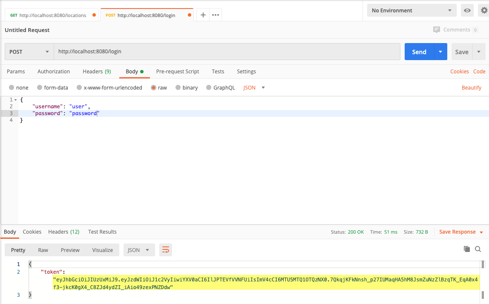
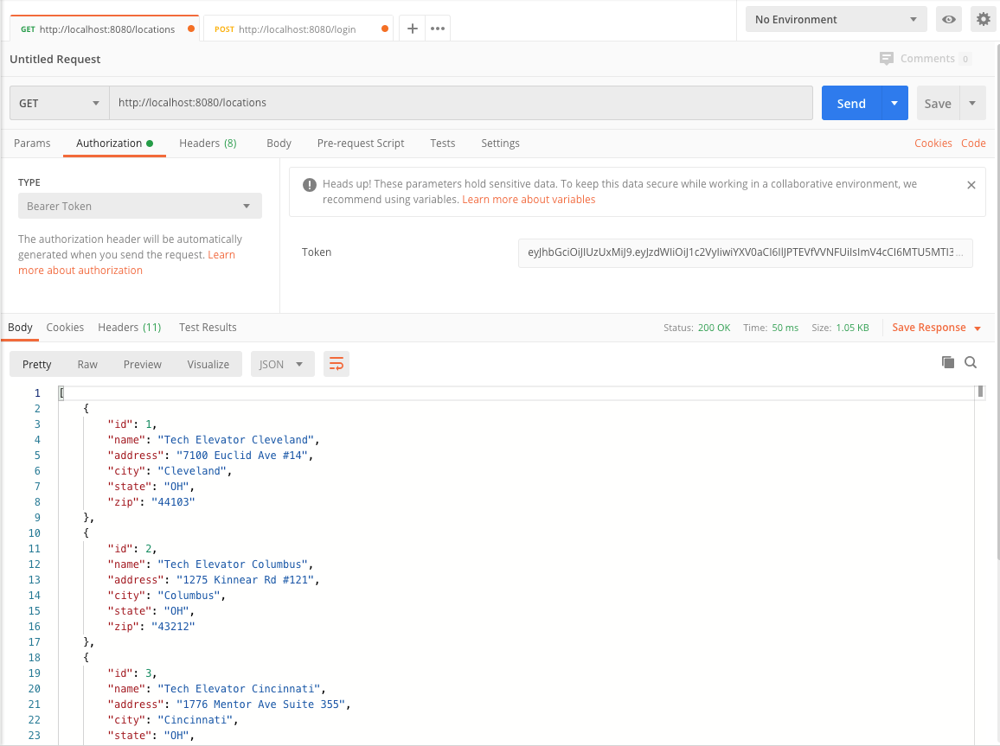

# Authentication Tutorial (Java)

In this tutorial, you'll continue working on an application that uses Tech Elevator Locations as the data model. You'll add the ability to log in to the client application and send the authentication token with any request.

## Step One: Import project into Eclipse and explore starting code

Before you begin, import both the client and server starter code into Eclipse by using the "Import Existing Maven Projects" feature. Then, review the starting code.

### Client

If you run the application, you'll notice the new menu option, option 6, for logging in:

```bash
Welcome to Tech Elevator Locations. Please make a selection:
1: List Tech Elevator Locations
2: Show Tech Elevator Location Details
3: Add a Tech Elevator Location
4: Update a Tech Elevator Location
5: Delete a Tech Elevator Location
6: Login
0: Exit
```

If you have time, examine the code that makes this login feature work. It starts in `App.java` with menu selection 6:

```java
} else if (menuSelection == 6) {
    String credentials = consoleService.promptForLogin();
    if( credentials.split(",").length == 2 ) {
        ResponseEntity<Map> response = authenticationService.login(credentials);
        if (response.hasBody()) {
            String token = (String) response.getBody().get("token");
            locationService.AUTH_TOKEN = token;
            System.out.println("Login Successful");
        }
    } else {
        consoleService.printError("Please enter username and password separated by a comma.");
    }
}
```

If you successfully log in, you'll receive an authentication token. You'll take that token and set the variable `AUTH_TOKEN` in the location service which you can then use to pass to any method in the API that requires authentication.

### Server

The server application should look familiar to you as it picks up where you left off in the previous tutorial. There's a new package called `security` that contains the code needed to implement authentication.

## Step Two: Run the applications

Now that you've set up your projects in Eclipse and reviewed the starting code, run both of them to make sure everything works. It's best to make sure the application runs before adding anything new to it.

## Step Three: Test the REST API in Postman

After starting the server application, you'll need to test the REST API in Postman before writing any client code. Open Postman and try to get a list of locations by visiting http://localhost:8080/locations. This and every request mapping in the `LocationController` returns a `401 Unauthorized` response.


Before sending any requests to the API, you need to log in and then use the authentication token that's sent back to you in any subsequent requests. Start by sending a `POST` request to `/login` with a username and password. There's a user in the system with a username of `user` and a password of `password`.



> Note: If you send a bad username and password, what happens?

The response is a JSON key-value pair where the key is `id_token`. You want to copy everything inside the double quotes because this is your authentication token. Now you can go back to the `GET` locations request that failed. 

Under "Authorization", select the type `Bearer Token` and paste your token into the token field. This time, you'll pass authentication and receive a list of locations.



## Step Four: List all locations

Now that you've tested the API using Postman, you should know what you need to do in the client. You'll need to log in using the client application, store the authentication token, and then pass that token in an authorization header each time you make a call to the API.

Start by running the client application and selecting option 1 to list all of the locations. As expected, you receive a `401 Unauthorized` response:

```bash
Please choose an option: 1
--------------------------------------------
401 : {"timestamp":"2020-06-03T14:40:04.112+00:00","status":401,"error":"Unauthorized","message":"Full authentication is required to access this resource","path":"/locations"}
Locations
--------------------------------------------
```

### Location Service

Open `/src/main/java/com/techelevator/services/LocationService.java` and locate the `getAll()` method. To pass the authentication token, you need to create a new `HttpHeaders` instance. That class has a method for setting the `Bearer Token` called `setBearerAuth()`:

```java
public Location[] getAll() throws LocationServiceException {
    Location[] locations = null;
    try {
        // Authorization: Bearer {AUTH_TOKEN} Header
        HttpHeaders headers = new HttpHeaders();
        headers.setBearerAuth(AUTH_TOKEN);
        locations = restTemplate.getForObject(BASE_URL, Location[].class);
    } catch (RestClientResponseException ex) {
        throw new LocationServiceException(ex.getRawStatusCode() + " : " + ex.getResponseBodyAsString());
    }
    return locations;
}
```

To get a list of locations, you previously used `RestTemplate`'s `getForObject()` method. This method is a convenience method and is used when you need to make a `GET` request. In your case, you need to send additional information with the `GET` request, so you'll use another method called `exchange()`. This method takes an `HttpEntity` as an argument. The `HttpEntity` contains the headers you need to send in the request:

```java
public Location[] getAll() throws LocationServiceException {
    Location[] locations = null;
    try {
        // Authorization: Bearer {AUTH_TOKEN} Header
        HttpHeaders headers = new HttpHeaders();
        headers.setBearerAuth(AUTH_TOKEN);
        HttpEntity entity = new HttpEntity<>(headers);
        locations = restTemplate.exchange(BASE_URL, HttpMethod.GET, entity, Location[].class).getBody();
    } catch (RestClientResponseException ex) {
        throw new LocationServiceException(ex.getRawStatusCode() + " : " + ex.getResponseBodyAsString());
    }
    return locations;
}
```

Run the client application, log in, and then try to list all of the locations.

## Step Five: Get a single location

If you try to get the details for a single location, you'll receive the same `401 Unauthorized` response. Open `LocationService.java` and find the `getOne()` method. The changes you need to make here are similar to the ones you made for the `getAll()` method. Try to update this method on your own before looking at the answer below:

```java
public Location getOne(int id) throws LocationServiceException {
    Location location = null;
    try {
        // Authorization: Bearer {AUTH_TOKEN} Header
        HttpHeaders headers = new HttpHeaders();
        headers.setBearerAuth(AUTH_TOKEN);
        HttpEntity entity = new HttpEntity<>(headers);
        location = restTemplate.exchange(BASE_URL + "/" + id, HttpMethod.GET, entity, Location.class).getBody();
    } catch (RestClientResponseException ex) {
        throw new LocationServiceException(ex.getRawStatusCode() + " : " + ex.getResponseBodyAsString());
    }
    return location;
}
```

> Note: If you're having trouble with this, here's a tip that may help: run the program in debug mode and place breakpoints in the `LocationService.java` methods `getAll()` or `getOne()`. Step through the execution of the program line by line to see what's happening.

## Step Six: Refactor entity and headers

Whenever you duplicate code, you should ask yourself, "Is there an opportunity to refactor this?"

The answer is usually, "yes." 

You used the same three lines of code each of the previous methods:

```java
HttpHeaders headers = new HttpHeaders();
headers.setBearerAuth(AUTH_TOKEN);
HttpEntity entity = new HttpEntity<>(headers);
```

You can extract that code into a new `private` method called `makeAuthEntity()` because it's only used within `LocationService.java`:

```java
private HttpEntity makeAuthEntity() {
    HttpHeaders headers = new HttpHeaders();
    headers.setBearerAuth(AUTH_TOKEN);
    HttpEntity entity = new HttpEntity<>(headers);
    return entity;
}
```

Now, in your `GET` methods, you can call the `makeAuthEntity()` as the third argument to `restTemplate.exchange()`:

```java
public Location getOne(int id) throws LocationServiceException {
    Location location = null;
    try {
        location = restTemplate.exchange(BASE_URL + "/" + id, HttpMethod.GET, makeAuthEntity(), Location.class).getBody();
    } catch (RestClientResponseException ex) {
        throw new LocationServiceException(ex.getRawStatusCode() + " : " + ex.getResponseBodyAsString());
    }
    return location;
}

public Location[] getAll() throws LocationServiceException {
    Location[] locations = null;
    try {
        locations = restTemplate.exchange(BASE_URL, HttpMethod.GET, makeAuthEntity(), Location[].class).getBody();
    } catch (RestClientResponseException ex) {
        throw new LocationServiceException(ex.getRawStatusCode() + " : " + ex.getResponseBodyAsString());
    }
    return locations;
}
```

> Note: You'll also use this for the `DELETE` request because it's another operation that doesn't send a request body.

## Step Seven: Create and update location

The `add()` and `update()` methods also avoid duplicating logic by calling the method `makeLocationEntity()`. This method is different from the method you previously created because it also needs to send the location as content in the request body:

```java
public Location add(String CSV) throws LocationServiceException {
    Location location = makeLocation(CSV);
    if (location == null) {
        return null;
    }
    try {
        location = restTemplate.postForObject(BASE_URL, makeLocationEntity(location), Location.class);
    } catch (RestClientResponseException ex) {
        throw new LocationServiceException(ex.getRawStatusCode() + " : " + ex.getResponseBodyAsString());
    }
    return location;
}
```

Here's the `update()` method: 

```java
public Location update(String CSV) throws LocationServiceException {
    Location location = makeLocation(CSV);
    if (location == null) {
        return null;
    }
    try {
        restTemplate.exchange(BASE_URL + "/" + location.getId(), HttpMethod.PUT, makeLocationEntity(location), Location.class);
    } catch (RestClientResponseException ex) {
        throw new LocationServiceException(ex.getRawStatusCode() + " : " + ex.getResponseBodyAsString());
    }
    return location;
}
```

However, if you try to log in right now and create or update a location, it won't work. This is because the `makeLocationEntity()` method doesn't include the authentication token in the request header. 

Try to modify this method on your own before looking at the answer below:

```java
private HttpEntity<Location> makeLocationEntity(Location location){
    HttpHeaders headers = new HttpHeaders();
    headers.setContentType(MediaType.APPLICATION_JSON);
    headers.setBearerAuth(AUTH_TOKEN);
    HttpEntity<Location> entity = new HttpEntity<>(location, headers);
    return entity;
}
```

If you run the application, you can now create and update a location.

> Review tip: Review the Web Services POST student book, tutorial, and lecture for additional examples of combining body content with request headers. In particular, review the `makeEntity()` and `makeLocation()` methods in the tutorial.

## Step Eight: Delete a location

The last step is to modify the delete method. This is similar to the `GET` methods because you're not sending anything in the request body. You need to replace the convenience method `restTemplate.delete()` with the lower level `exchange()` method. Try to do this on your own before looking at the answer below:

```java
public void delete(int id) throws LocationServiceException {
    try {
        restTemplate.exchange(BASE_URL + "/" + id, HttpMethod.DELETE, makeAuthEntity(), String.class);
    } catch (RestClientResponseException ex) {
        throw new LocationServiceException(ex.getRawStatusCode() + " : " + ex.getResponseBodyAsString());
    }
}
```

Now, you can run the client and the server. If you encounter problems, review the steps again to ensure that you completed each step correctly. If the requests work in Postman, but not in the client, you might need to review the `LocationService` again.

## Summary

In this tutorial, you learned:

- How to test a secure API using Postman
- How to send an authentication token using `RestTemplate`
- How to use the `RestTemplate` `exchange()` method for `GET`, `POST`, `PUT`, and `DELETE`.
