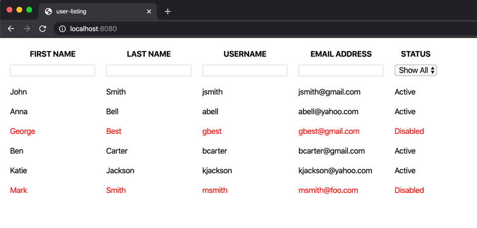

# Introduction to Vue.js Exercise

In this exercise, you'll display a list of users in a table. You'll also add some filtering features to the table that allow your visitors to filter data in each column. When you've completed the exercise, you should have something like this:

## Step One: Initialize the project

Run `npm install` before working on the project. After opening the project folder in Visual Studio Code, open the `View` menu and click on `Terminal`, or press `` Ctrl+` `` on Windows or `` ⌘+` `` on a Mac.

## Step Two: Run unit tests

There are unit tests located in `/tests/unit/UserList.spec.js` that you can run as you complete each task. To run the automated tests, run the command `npm run test:unit` from the terminal. There are **15** unit tests, and all of them fail before you begin writing any code.

## Step Three: Display users

If you look in the `data()` function in `UserList.vue`, you'll see an array of users with some different properties. Your first task is to iterate over the array of users and display each property of the user in the appropriate column. There are six users in the array, so you'll end up with six table rows (tr) of data.

> When you've completed this task, you'll see the user information in the UI. 1 of 15 tests now pass.

## Step Four: Create column filters

The first row in each column should contain a filter that allows you to filter the data in that column. To do this, create a data property called `filter` that is an object with the following properties:

- firstName
- lastName
- username
- emailAddress
- status

Each property in the filter object needs to be "connected" to the appropriate input or select field.

> When you've completed this task, you won't see any obvious changes in the UI. 6 of 15 tests now pass.

## Step Five: Create computed properties

In your first task, you were asked to loop over the list of users and display them. To have the data update in the table as you type, you'll need to create a computed property called `filteredList`. This computed property looks at the `filter` object and filters the list of users depending on what's in the filter input boxes. The search is a combination of all filters (AND) is a LIKE search (contains/includes). All text comparisons should be case insensitive.

> When you've completed this task, 14 of 15 tests pass.

## Step Six: Add `disabled` class

You should be able to add the `disabled` class to any row where the user status is equal to `Disabled`.

> When you've completed this task, all tests pass.

## Summary

In this exercise, you learned:

- How to initialize an existing project
- How to run unit tests on a Vue project
- How to use `v-for` to loop through data properties
- How to use `{{ }}` to bind data properties to UI elements
- How to use `computed` properties to filter data properties
- How to use `v-bind` to connect data properties to CSS classes
